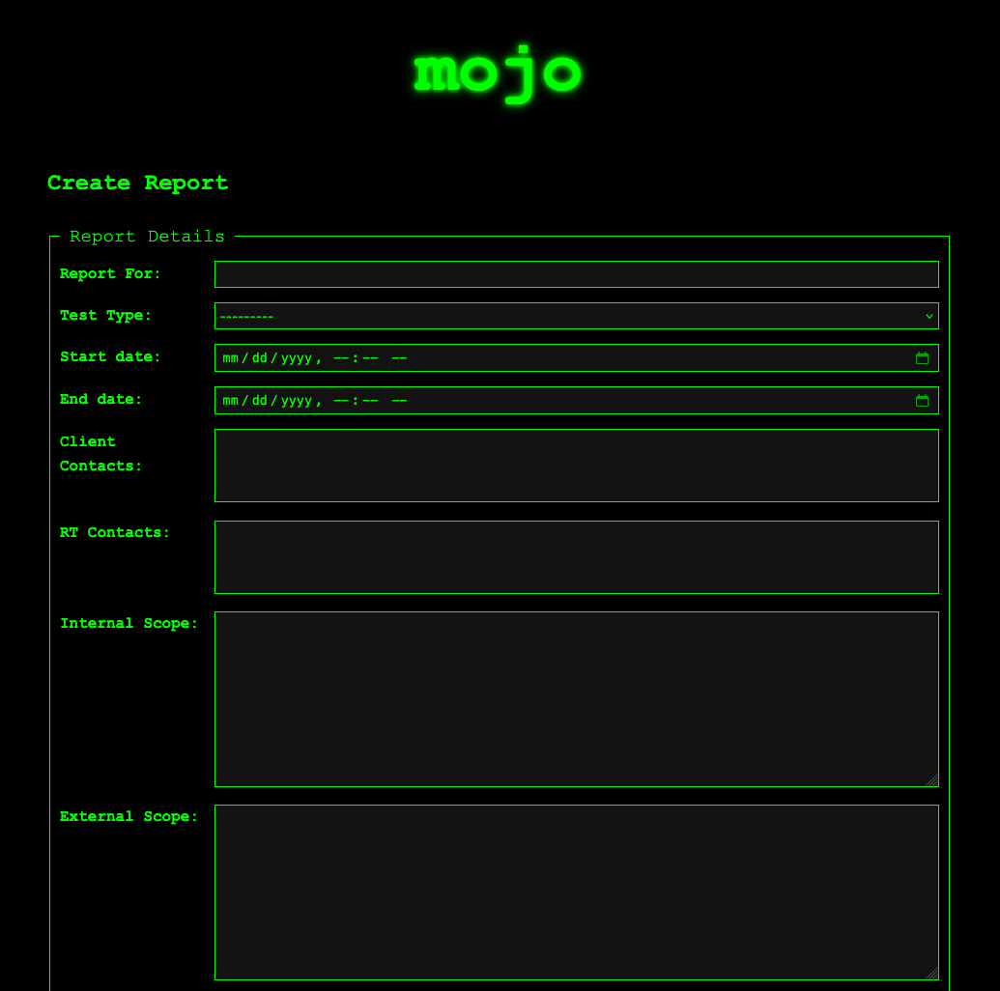

# **Mojo: Cybersecurity Intelligence & Reporting Framework**  

### **🔍 Overview**  
**Mojo** is a cutting-edge cybersecurity intelligence and reporting framework designed to streamline **vulnerability assessment, risk analysis, and reporting** for penetration testing engagements. Built with **Django**, it offers a robust, scalable platform for managing findings, generating detailed reports, and integrating security insights with modern offensive security workflows.

With an intuitive interface, **Mojo** enables security professionals to efficiently document vulnerabilities, manage client engagements, and automate report generation—reducing overhead while ensuring comprehensive security assessments.

---

## **🚀 Features**  

✅ **Findings Management** – Organize and track security vulnerabilities across multiple engagements.  
✅ **Dynamic Screenshot Handling** – Upload, preview, and manage screenshots linked to findings.  
✅ **Automated Report Generation** – Create detailed pentest reports in multiple formats with customizable templates.  
✅ **Risk Level & Scoring** – Standardized risk assessment using CVSS scoring and custom overrides.  
✅ **Engagement Tracking** – Associate findings with specific security assessments for streamlined management.  
✅ **Django Admin Integration** – Granular control over findings, reports, and user management.  
✅ **Dark Hacker-Themed UI** – A sleek, **neon green terminal-inspired** interface for a modern pentesting experience.  

---

## **📌 Use Cases**  

🔹 **Penetration Testing Engagements** – Track vulnerabilities, organize evidence, and produce high-quality reports.  
🔹 **Risk Assessment & Compliance Audits** – Evaluate security risks based on **CVSS scoring** and **custom risk matrices**.  
🔹 **Cybersecurity Research & Analysis** – Maintain a structured database of findings, **linked screenshots**, and security insights.  
🔹 **Red & Blue Team Collaboration** – Enable smooth information exchange between offensive and defensive security teams.  

---

## **💻 Tech Stack**  

🛠 **Backend**: Django (Python)  
🎨 **Frontend**: HTML, CSS (Dark hacker-themed UI)  
📦 **Database**: PostgreSQL / SQLite / MySQL 
📜 **Reporting**: Dynamic document generation via Python-based templates  

---

## **📌 TODOs**
- `REPORTING_TEAM` needs to be updated in the `generate_doc` function to take an input. This means updating the **Report** model.
- Create a page to import scan data (**functionality already exists in superdupperadmin**).
- Implement a guided flow to import findings and then generate reports.

---

## **📖 Setup**  

### **Clone the repository**  
```
git clone --recursive https://github.com/H4CK-7H3-P14N37/mojo.git
```
## create persistent SECRET_KEY
### NOTE: this will only give a string to copy/paste into .env file
```
./gen_secret_key.py
```

## Your .env file should look like this with a random string.
```
SECRET_KEY=+7^q$nv1x0asdfasdfasdfasdfasdfasdfasdfasdfasdf$s!*^h
```

## build the image
```
./build.sh
```

## run the image
```
./run.sh
```

## from here, you should be able to open the app locally
```
http://127.0.0.1:8000/
```

## if you go to superdupperadmin, you should be able to use the default creds
```
username: root
password: redteamroxs
```

# Cleanup
## if you want to delete all containers, run this. it will delete the database, containers, finding images, everything.
```
./cleanup.sh
```

## if you want to clean the images, do this
```
docker rmi mojo
```

# Preview of app

